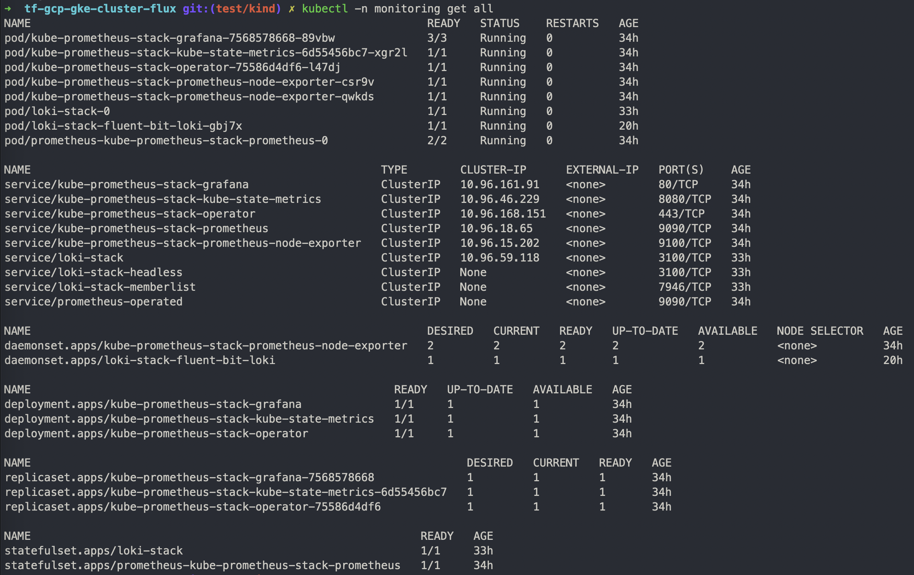

# flux-monitoring
`flux-monitoring` is a project that provides instructions and resources for setting up monitoring on your Kubernetes cluster with Flux, Prometheus, Loki, Fluent-bit and Grafana.


# Source
- [Flux monitoring with Prometheus](https://fluxcd.io/flux/guides/monitoring/)
- [OpenTelemetry Operator for Kubernetes](https://github.com/open-telemetry/opentelemetry-operator)

## Setup
This setup assumes that you have Flux installed on your cluster and it is properly configured.


## Register the Git Repository
Firstly, register the Git repository on your cluster:

```bash
flux create source git flux-monitoring \
  --interval=30m \
  --url=https://github.com/vanelin/flux-monitoring \
  --branch=main
```

Install the Prometheus Stack:

```bash
flux create kustomization kube-prometheus-stack \
  --interval=1h \
  --prune \
  --source=flux-monitoring \
  --path="./monitoring/kube-prometheus-stack" \
  --health-check-timeout=5m \
  --wait
```

Install the Loki Stack + Fluent-bit:

```bash
flux create kustomization loki-stack \
  --depends-on=kube-prometheus-stack \
  --interval=1h \
  --prune \
  --source=flux-monitoring \
  --path="./monitoring/loki-stack" \
  --health-check-timeout=5m \
  --wait
```

Install Flux Grafana Dashboards:

```bash
flux create kustomization monitoring-config \
  --depends-on=kube-prometheus-stack \
  --interval=1h \
  --prune=true \
  --source=flux-monitoring \
  --path="./monitoring/monitoring-config" \
  --health-check-timeout=1m \
  --wait
```



---


## Accessing Grafana
You can access Grafana using port forwarding:

```bash
kubectl -n monitoring port-forward svc/kube-prometheus-stack-grafana 3000:80

# or to bind to all interfaces
kubectl --namespace monitoring port-forward --address 0.0.0.0  svc/kube-prometheus-stack-grafana 3000:80

# Get password Grafana
kubectl get secret --namespace monitoring kube-prometheus-stack-grafana -o jsonpath="{.data.admin-password}" | base64 --decode ; echo

```

Control plane dashboard http://localhost:3000/d/flux-control-plane:


Cluster reconciliation dashboard http://localhost:3000/d/flux-cluster:


---
## In the integration stage, **not working yet**:
```bash
# To install the opentelemetry-operator in an existing cluster, make sure you have cert-manager installed and run
kubectl apply -f https://github.com/cert-manager/cert-manager/releases/download/v1.12.2/cert-manager.yaml


flux create source helm jetstack \
  --url=https://charts.jetstack.io \
  --interval=10m \
  --namespace=flux-system

flux create kustomization cert-manager \
  --interval=1h \
  --retry-interval=1m \
  --prune=true \
  --source=flux-monitoring \
  --path="./monitoring/cert-manager" \
  --health-check-timeout=1m \
  --wait

# Install opentelemetry-operator
flux create source helm open-telemetry \
  --url=https://open-telemetry.github.io/opentelemetry-helm-charts \
  --interval=10m \
  --namespace=flux-system

flux create kustomization open-telemetry \
  --interval=1h \
  --prune=true \
  --source=flux-monitoring \
  --path="./monitoring/open-telemetry" \
  --health-check-timeout=1m \
  --wait
  ```